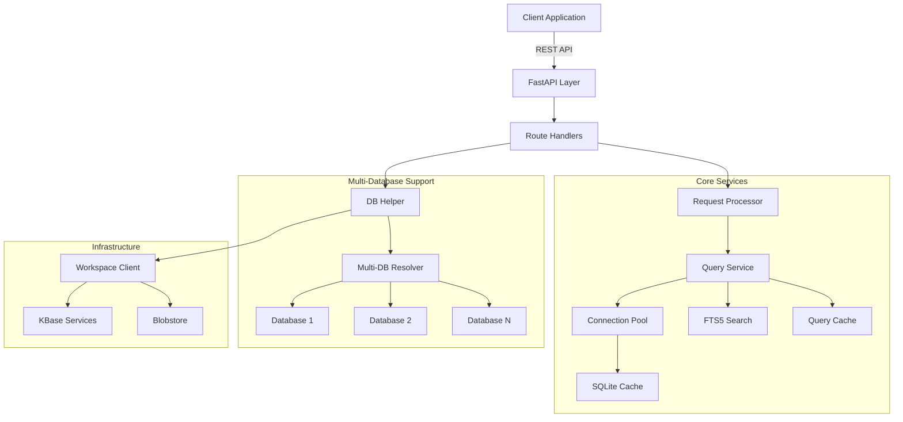

# TableScanner Architecture

## Overview

TableScanner is a high-performance, read-only microservice designed to provide efficient access to tabular data stored in KBase (Workspace Objects or Blobstore Handles). It serves as a backend for the DataTables Viewer and other applications requiring filtered, paginated, and aggregated views of large datasets.

**Production URL**: `https://appdev.kbase.us/services/berdl_table_scanner`

## System Architecture



## Core Components

### 1. API Layer (`app/routes.py`)

The entry point for all requests. Handles:

| Endpoint | Purpose |
|----------|---------|
| `/object/{ws_ref}/tables` | List tables in single-DB object |
| `/databases?upa={ws_ref}` | List databases in multi-DB object (v2.1) |
| `/db/{db_name}/tables?upa={ws_ref}` | List tables in specific database (v2.1) |
| `/db/{db_name}/tables/{table}/data?upa={ws_ref}` | Query specific database (v2.1) |
| `/table-data` | Advanced filtering (POST) |
| `/upload` | Local file upload |

### 2. Query Service (`app/services/data/query_service.py`)

The heart of the application. It orchestrates query execution:

- **Type-Aware Filtering**: Automatically detects column types (text vs numeric) and applies correct SQL operators
- **Advanced Aggregations**: Supports `GROUP BY`, `SUM`, `AVG`, `COUNT`, etc.
- **Full-Text Search**: Leverages SQLite FTS5 for fast global searching
- **Result Caching**: Caches query results to minimize database I/O for repeated requests

### 3. Connection Pool (`app/services/data/connection_pool.py`)

Manages SQLite database connections efficiently:

- **Pooling**: Reuses connections to avoid open/close overhead
- **Lifecycle**: Automatically closes idle connections after a timeout
- **Optimization**: Configures PRAGMAs (WAL mode, memory mapping) for performance

### 4. Multi-Database Support (v2.1)

Objects containing multiple pangenomes are supported via new endpoints:

```
/databases?upa={ws_ref}              → List all databases
/db/{db_name}/...?upa={ws_ref}       → Access specific database
```

Each database within an object is stored as a separate SQLite file, enabling:
- Independent table schemas per database
- Parallel access to different databases
- Clear separation of data scopes

### 5. Infrastructure Layer

- **DB Helper (`app/services/db_helper.py`)**: Resolves workspace refs or handles into local file paths, handling download and caching transparently
- **Workspace Client (`app/utils/workspace.py`)**: Interacts with KBase services, supporting both single and multi-database object downloads

## Data Flow

### Single Database Request

```
1. Request: GET /object/76990/7/2/tables/Genes/data?limit=100
2. Resolution: DB Helper checks cache for 76990/7/2
   - Miss: Downloads from KBase Blobstore
   - Hit: Returns path to local .db file
3. Connection: QueryService gets connection from Pool
4. Execution: SQLite query with parameterized filters
5. Response: JSON with headers, data, metadata
```

### Multi-Database Request (v2.1)

```
1. Request: GET /object/76990/7/2/db/pg_ecoli_k12/tables/Genes/data
2. Resolution: DB Helper downloads ALL databases in object
3. Selection: Multi-DB resolver selects "pg_ecoli_k12" database
4. Connection: QueryService gets connection for specific DB file
5. Execution: SQLite query on selected database
6. Response: JSON with data from specific database
```

## Design Decisions

| Decision | Rationale |
|----------|-----------|
| **Read-Only** | Simplifies concurrency control (WAL mode) |
| **Synchronous I/O in Async App** | Uses `run_sync_in_thread` to offload blocking SQLite operations |
| **Local Caching** | Avoids high latency of downloading multi-GB files repeatedly |
| **SHA-256 Deduplication** | Prevents duplicate file storage for uploads |
| **Multi-Level Caching** | Query cache (5min), DB file cache (24h), connection pool (30min) |
| **Streaming Uploads** | 1MB chunks for large file handling without memory exhaustion |

## Security

- **Authentication**: All data endpoints require valid KBase Auth Token
- **Authorization**: Relies on KBase Services to validate access permissions
- **SQL Injection Prevention**: Parameterized queries + table name validation via `sqlite_master`
- **Path Traversal Prevention**: Strict ID sanitization in cache paths
- **Upload Validation**: SQLite header verification before processing
- **Storage Quotas**: 10GB limit with automatic cleanup
