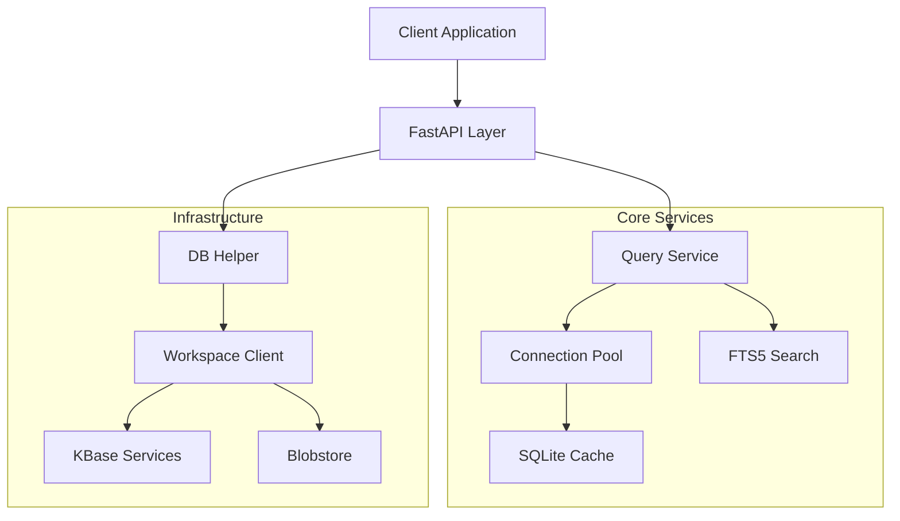

# TableScanner Architecture

## Overview
TableScanner is a high-performance, read-only microservice designed to provide efficient access to tabular data stored in KBase (Workspace Objects or Blobstore Handles). It serves as a backend for the DataTables Viewer and other applications requiring filtered, paginated, and aggregated views of large datasets.

## System Architecture

## Core Components

### 1. API Layer (`app/routes.py`)
The entry point for all requests. It handles:
-   **Handle Access**: `/handle/{handle_ref}/tables`
-   **Object Access**: `/object/{ws_ref}/tables`
-   **Data Queries**: `/table-data` (Advanced filtering)
-   **Legacy Compatibility**: Backward-compatible endpoints for older clients.

### 2. Query Service (`app/services/data/query_service.py`)
The heart of the application. It orchestrates query execution:
-   **Type-Aware Filtering**: Automatically detects column types (text vs numeric) and applies correct SQL operators.
-   **Advanced Aggregations**: Supports `GROUP BY`, `SUM`, `AVG`, `COUNT`, etc.
-   **Full-Text Search**: Leverages SQLite FTS5 for fast global searching.
-   **Result Caching**: Caches query results to minimize database I/O for repeated requests.

### 3. Connection Pool (`app/services/data/connection_pool.py`)
Manages SQLite database connections efficiently:
-   **Pooling**: Reuses connections to avoid open/close overhead.
-   **Lifecycle**: Automatically closes idle connections after a timeout.
-   **Optimization**: Configures PRAGMAs (WAL mode, memory mapping) for performance.

### 4. Infrastructure Layer
-   **DB Helper (`app/services/db_helper.py`)**: Resolves "Handle Refs" or "Workspace Refs" into local file paths, handling download and caching transparently.
-   **Workspace Client (`app/utils/workspace.py`)**: Interacts with KBase services, falling back to direct HTTP queries if SDK clients are unavailable.

## Data Flow

1.  **Request**: Client requests data (e.g., `GET /object/123/1/1/tables/Genes/data?limit=100`).
2.  **Resolution**: `DB Helper` checks if the database for `123/1/1` is in the local cache.
    -   *Miss*: Downloads file from KBase Blobstore/Workspace.
    -   *Hit*: Returns path to local `.db` file.
3.  **Connection**: `QueryService` requests a connection from `ConnectionPool`.
4.  **Query Plan**:
    -   Checks schema for column types.
    -   Builds SQL query with parameterized filters.
    -   Ensures necessary indexes exist.
5.  **Execution**: SQLite executes the query (using FTS or B-Tree indexes).
6.  **Response**: Data is returned to the client as JSON.

## Design Decisions

-   **Read-Only**: The service never modifies the source SQLite files. This simplifies concurrency control (WAL mode).
-   **Synchronous I/O in Async App**: We use `run_sync_in_thread` to offload blocking SQLite operations to a thread pool, keeping the FastAPI event loop responsive.
-   **Local Caching**: We aggressively cache database files locally to avoid the high latency of downloading multi-GB files from KBase for every request.

## Security
-   **Authentication**: All data access endpoints require a valid KBase Auth Token (`Authorization` header).
-   **Authorization**: The service relies on KBase Services to validate if the token has access to the requested Workspace Object or Handle.
-   **Input Validation**: Strict validation of table and column names prevents SQL injection. Parameterized queries are used for all values.
