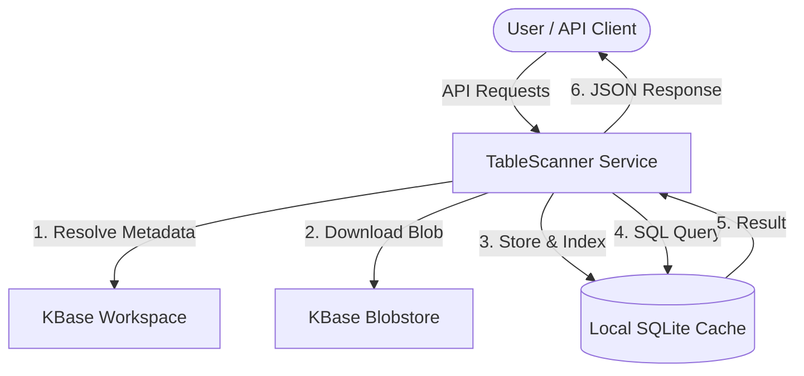

# TableScanner Architecture

TableScanner is a high-performance middleware service designed to provide fast, filtered, and paginated access to large tabular data stored in KBase. It solves the performance bottleneck of loading massive objects into memory by leveraging local SQLite caching and efficient indexing.

---

## High-Level Architecture

---

## Caching Strategy: One DB per UPA

TableScanner employs a strict **one-database-per-object** caching policy. Each KBase object reference (UPA, e.g., `76990/7/2`) is mapped to a unique local directory.

-   **Path Structure**: `{CACHE_DIR}/{sanitized_UPA}/tables.db`
-   **Sanitization**: Special characters like `/`, `:`, and spaces are replaced with underscores to ensure filesystem compatibility.
-   **Granularity**: Caching is performed at the object level. If multiple tables exist within a single SQLite blob, they are all cached together, improving subsequent access to related data.

---

## Race Condition and Atomic Handling

To ensure reliability in high-concurrency environments (multiple users requesting the same data simultaneously), TableScanner implements **Atomic File Operations**:

### 1. Atomic Downloads
When a database needs to be downloaded, TableScanner does **not** download directly to the final path.
1.  A unique temporary filename is generated using a UUID: `tables.db.{uuid}.tmp`.
2.  The file is downloaded from the KBase Blobstore into this temporary file.
3.  Once the download is successful and verified, a **filesystem-level atomic rename** (`os.rename`) is performed to move it to `tables.db`.
4.  This ensures that if a process crashes or a network error occurs, the cache directory will not contain a partially-downloaded, corrupt database.

### 2. Concurrent Request Handling
If two requests for the same UPA arrive at the same time:
-   Both will check for the existence of `tables.db`.
-   If it's missing, both may start a download to their own unique `temp` files.
-   The first one to finish will atomically rename its temp file to `tables.db`.
-   The second one to finish will also rename its file, overwriting the first. Since the content is identical (same UPA), the final state remains consistent and the database is never in a corrupt state during the swap.

---

## Performance Optimization: Automatic Indexing

TableScanner doesn't just store the data; it optimizes it. Upon the **first access** to any table:
-   The service scans the table schema.
-   It automatically generates a `idx_{table}_{column}` index for **every single column** in the table.
-   This "Indexing on Demand" strategy ensures that even complex global searches or specific column filters remain sub-millisecond, regardless of the table size.

---

## Data Lifecycle in Detail

1.  **Request**: User provides a KBase UPA and query parameters.
2.  **Cache Verification**: Service checks if `{sanitized_UPA}/tables.db` exists and is valid.
3.  **Metadata Resolution**: If not cached, `KBUtilLib` fetches the object from KBase to extract the Blobstore handle.
4.  **Secure Download**: The blob is streamed to a temporary UUID file and then atomically renamed.
5.  **Schema Check**: TableScanner verifies the requested table exists in the SQLite file.
6.  **Index Check**: If it's the first time this table is being queried, indices are created for all columns.
7.  **SQL Execution**: A standard SQL query with `LIMIT`, `OFFSET`, and `LIKE` filters is executed.
8.  **Streaming Serialization**: Results are converted into a compact JSON list-of-lists and returned to the user.

---

## Tech Stack and Key Components

-   **FastAPI**: Provides the high-performance async web layer.
-   **SQLite**: The storage engine for tabular data, chosen for its zero-configuration and high performance with indices.
-   **KBUtilLib**: Handles complex KBase Workspace and Blobstore interactions.
-   **UUID-based Temp Storage**: Prevents race conditions during file I/O.
